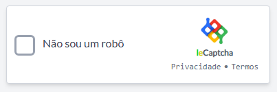
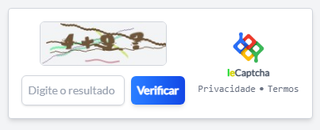
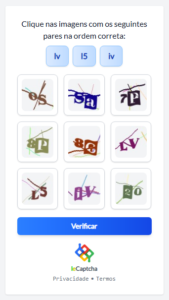

# 🤖 leCaptcha - Multi Captcha System


Um sistema de **CAPTCHA moderno e elegante** com múltiplos desafios para validar usuários humanos em sua aplicação Laravel. Totalmente responsivo e fácil de integrar.

---

## 🚀 Recursos disponíveis

O **leCaptcha** oferece 5 tipos de validação para proteger seus formulários:

| Tipo          | Descrição                                                    | Demonstração                           |
| ------------- | ------------------------------------------------------------ | -------------------------------------- |
| **Text**      | Captcha tradicional com texto distorcido e linhas aleatórias |          |
| **Robot**     | Checkbox "Não sou um robô" com animações e validação AJAX    |        |
| **Math**      | Resolva operações matemáticas simples para passar no desafio |          |

---

## 🛠️ Instalação

1. Clone o repositório:

    ```bash
    git clone https://github.com/Leozinnh/leCaptcha.git
    cd leCaptcha
    ```

2. Instale as dependências:

    ```bash
    composer install
    npm install && npm run build
    ```

3. Configure o `.env`:

    ```bash
    cp .env.example .env
    php artisan key:generate
    ```

Edite o arquivo `.env` com suas credenciais:

    ```bash
    DB_DATABASE=captcha
    DB_USERNAME=root
    DB_PASSWORD=sua_senha
    ```

4. **Crie o banco de dados:**

    ```bash
    create database `captcha`
    default character set utf8
    default collate utf8_general_ci;
    ```

5. (Opcional) Publique os assets:

    ```bash
    php artisan vendor:publish
    ```

6. **Execute as migrations:**

    ```bash
    php artisan migrate
    ```

7. (Opcional) Gere a chave:

    ```bash
    php artisan key:generate
    ```

8. Rode o servidor:
    ```bash
    php artisan serve
    ```

Acesse: http://localhost:8000

---

## 🌐 Rotas disponíveis

| Rota                | Tipo | Descrição                          |
| ------------------- | ---- | ---------------------------------- |
| `/captcha/text`     | GET  | Exibe Captcha de texto             |
| `/captcha/grid`     | GET  | Exibe Captcha com grade de imagens |
| `/captcha/dragdrop` | GET  | Exibe o Captcha Drag & Drop        |
| `/captcha/robot`    | GET  | Exibe o checkbox "Não sou um robô" |
| `/captcha/math`     | GET  | Exibe o Captcha matemático         |

---

## ✨ Tecnologias usadas

-   **Laravel 10**
-   **Tailwind CSS 3**
-   **PHP 8**
-   **Alpine.js (para interação frontend)**
-   **GD Library (para geração de imagens)**

---

## 📸 Screenshots

|          |    |
| -------------------------------------- | -------------------------------- |
|  |  |

---

## 💬 Contato

📧 **Leonardo Alves** - [leonardoaf65572005@gmail.com](mailto:leonardoaf65572005@gmail.com)  
🔗 [github.com/Leozinnh](https://github.com/Leozinnh)

---
